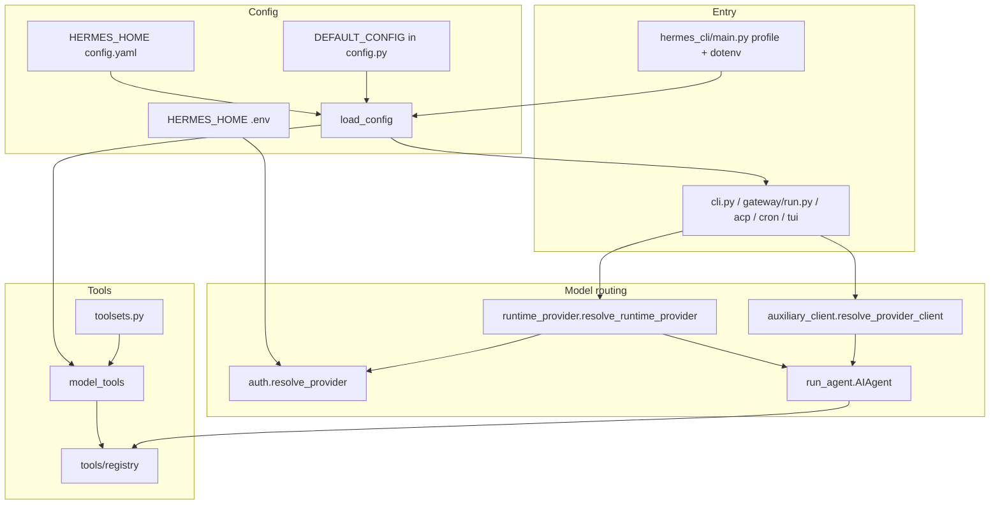

# Hermes runtime — architecture reference

Deep map of how Hermes wires **profiles**, **config**, **model routing**, and **runtime** together, plus what to change when adding new runtime capabilities.

---

## 1. Profiles and “where everything lives”

| Mechanism | Role |
|-----------|------|
| **`HERMES_HOME`** | Single source of truth for the active instance. Almost all state paths resolve through `get_hermes_home()` in `hermes_constants.py`. |
| **`hermes_cli/main.py` → `_apply_profile_override()`** | Runs **before** most Hermes imports: parses `--profile` / `-p`, or reads `~/.hermes/active_profile`, then sets `os.environ["HERMES_HOME"]`. |
| **`hermes_cli/profiles.py`** | Creates/manages `~/.hermes/profiles/<name>/`, bootstraps dirs (`memories`, `sessions`, `skills`, `logs`, `cron`, …), clone rules. |
| **`hermes_constants.get_hermes_home()`** | `Path(os.environ["HERMES_HOME"])` or default `~/.hermes`. Also contains **fallback warning** if `active_profile` says non-default but env is unset (subprocesses must set `HERMES_HOME`). |
| **`hermes_constants.display_hermes_home()`** | User-facing path (`~/.hermes` vs profile path). Use in messages/tool schemas per repo `AGENTS.md`. |

**Rule:** Any new persistent file, cache, or socket path should use **`get_hermes_home()`**, not `Path.home() / ".hermes"`.

**Linux VPS (systemd):** Install the boot-time gateway with **`sudo hermes gateway install --system --run-as-user <unix-user>`** (run from the repo checkout, e.g. `cd /home/hermesuser/hermes-agent`). The unit’s **`User=`** must match the owner of **`HERMES_HOME`** (typically `/home/<user>/.hermes`). If the process was ever started as **root** against that tree, run **`chown -R <user>:<user> $HERMES_HOME`** after stopping the old process, then install/start the service as above. Day-to-day **`start|stop|restart`** for the system unit still require **`sudo hermes gateway … --system`**.

---

## 2. Configuration files (what actually drives runtime)

| File / API | Purpose |
|------------|---------|
| **`$HERMES_HOME/config.yaml`** | Merged onto **`DEFAULT_CONFIG`** in `hermes_cli/config.py` via `load_config()` (cached by mtime/size). Main **schema** for model, toolsets, agent limits, auxiliary tasks, plugins, platforms, etc. |
| **`$HERMES_HOME/.env`** | Secrets and env-backed overrides; loaded via `hermes_cli/env_loader.py` / `load_env()` patterns (see `main.py` bootstrap). |
| **`$HERMES_HOME/auth.json`** | Provider credentials / active provider (used with `hermes_cli/auth.py`). |
| **`DEFAULT_CONFIG` dict** (`config.py` ~395+) | Default values for **everything** not set in yaml; new top-level or nested keys often need defaults here + migration/validation if you want wizard safety. |
| **`read_raw_config()`** | On-disk yaml without defaults (used when preserving env refs on save). |

**Managed installs:** Nix/Homebrew paths consult **`get_managed_system()`** / `.managed` marker; `save_config()` can refuse writes.

For **new runtime behavior that is user-tunable**, you almost always touch:

1. **`DEFAULT_CONFIG`** (defaults + documentation in code),
2. **`load_config` / `_expand_env_vars` / validators** if you add env interpolation or migrations,
3. **User-facing docs** under `website/docs/user-guide/configuration.md` (and sometimes Nix module under `nix/`).

---

## 3. Model and provider routing (main chat path)

Precedence is **explicit CLI/runtime → `config.yaml` model block → env / auto** (see `website/docs/developer-guide/provider-runtime.md`).

| Layer | File(s) | Responsibility |
|-------|---------|------------------|
| **Runtime package** | `hermes_cli/runtime_provider.py` | **`resolve_runtime_provider()`**: builds `{provider, api_mode, base_url, api_key, …}` for the **primary** model; handles Azure Foundry, **named `custom_providers`**, pools, etc. |
| **Provider id → credentials** | `hermes_cli/auth.py` | **`resolve_provider()`** (auto chain), API key scoping, aliases (`_PROVIDER_ALIASES`). |
| **Provider metadata** | `hermes_cli/providers.py` | **`resolve_provider_full()`** / definitions; bridges yaml `providers` blocks. |
| **Plugin providers** | `plugins/model-providers/<id>/` + `$HERMES_HOME/plugins/model-providers/<id>/` | YAML `plugin.yaml` + `register_provider()`; **preferred** for new first-class providers. |
| **Canonical profiles** | `providers/` package | `ProviderProfile`, `get_provider_profile()`, env var lists, `api_mode`, `fallback_models`. |
| **CLI / gateway model switch** | `hermes_cli/model_switch.py` | Shared `/model` pipeline (CLI + gateway). |
| **Agent construction** | `cli.py` (`HermesCLI._init_agent`, `_resolve_turn_agent_config`), `gateway/run.py`, `acp_adapter/server.py`, cron paths | Pass `base_url`, `api_key`, `provider`, `api_mode`, `model`, `request_overrides`, `fallback_model`, `credential_pool` into **`AIAgent`**. |
| **Actual HTTP client** | `run_agent.py` (`AIAgent`), `agent/` adapters (e.g. `anthropic_adapter.py`) | Uses resolved `api_mode` (`chat_completions`, `codex_responses`, `anthropic_messages`, …). |
| **Fallback model** | `config.yaml` `fallback_model`, `run_agent._try_activate_fallback`, CLI/gateway/cron loaders | Swaps client on errors (see provider-runtime doc). |
| **Billing / routing metadata** | `agent/usage_pricing.py` | **`resolve_billing_route()`** for cost accounting. |

**Auxiliary models** (vision, compression, MCP helper, etc.) branch through **`agent/auxiliary_client.py`**: **`resolve_provider_client()`**, **`_resolve_task_provider_model()`**, and **`config.yaml` → `auxiliary.<task>`** (defaults in `DEFAULT_CONFIG["auxiliary"]`).

---

## 4. Agent loop and “everything else” runtime

| Concern | Primary file(s) |
|---------|-------------------|
| **Tool loop, retries, streaming** | `run_agent.py` (`AIAgent`) |
| **Tool definitions** | `model_tools.py` → `tools/registry.py`, `tools/*.py` |
| **Which tools are visible** | `toolsets.py` + `config.yaml` `toolsets` / `agent.disabled_toolsets` |
| **Plugins (tools, platforms, memory providers)** | `hermes_cli/plugins.py` (`discover_plugins`), `model_tools.py` imports |
| **Persistent MEMORY / USER** | `tools/memory_tool.py` (`$HERMES_HOME/memories/MEMORY.md`, `USER.md`) |
| **Delegation / subagents** | `tools/delegate_tool.py` |
| **Compression** | `config.yaml` `compression`, logic in agent loop (see developer docs) |
| **Gateway** | `gateway/run.py` (`GatewayRunner`), platform adapters, startup MCP discovery |
| **ACP** | `acp_adapter/server.py` |
| **Cron** | `hermes_cli/cron` + config-driven jobs |
| **TUI** | `tui_gateway/server.py` |

---

## 5. “Deep” list: files you often touch for **new runtime features**

Use this as a checklist depending on feature type.

### A. New **inference provider** or routing mode

- `plugins/model-providers/<name>/` (plugin + `register_provider`) *preferred*
- Or `hermes_cli/runtime_provider.py` / `hermes_cli/auth.py` if you must special-case resolution
- `hermes_cli/providers.py` if adding static definition glue
- `providers/` if adding a shared `ProviderProfile`
- Tests under `tests/` for auth + resolution
- Docs: `website/docs/developer-guide/adding-providers.md`, `model-provider-plugin.md`, `provider-runtime.md`

### B. New **config knob**

- `hermes_cli/config.py`: `DEFAULT_CONFIG`, possibly `_normalize_*`, `save_config` comment blocks, wizard paths in `hermes_cli/main.py`
- Call sites: **`load_config()`** consumers (grep is the reliable way to find them)
- Nix: `nix/nixosModules.nix` or related if the option should be declarative

### C. New **tool** exposed to the model

- `tools/<name>.py` with `registry.register(...)`
- `toolsets.py` (expose via a toolset)
- Optional: `TOOLSET_REQUIREMENTS` / doctor checks if the tool needs env/deps

### D. New **plugin type** (platform, memory, image, …)

- New directory under `plugins/<category>/<name>/` with `plugin.yaml`
- `hermes_cli/plugins.py` discovery/hooks
- Config: `plugins.enabled` in `config.yaml` (see existing plugins)

### E. New **gateway / platform** behavior

- `gateway/run.py` and/or `plugins/platforms/<platform>/`
- `hermes_cli/gateway.py` (install, systemd, `HERMES_HOME` for services, `_profile_arg`)

### F. **Auxiliary** LLM use (side tasks)

- `DEFAULT_CONFIG["auxiliary"]` + `agent/auxiliary_client.py` task wiring
- Call sites that invoke the task (grep task name)

### G. **Profile / path** correctness

- Only **`get_hermes_home()`** / **`display_hermes_home()`** for paths
- Subprocess spawners: set **`HERMES_HOME`** (gateway templates, kanban, etc. — see comments in `hermes_constants.py`)

---

## 6. Official in-repo documentation (good second reads)

- `website/docs/developer-guide/provider-runtime.md` — routing diagram and precedence
- `website/docs/developer-guide/architecture.md` — system overview
- `website/docs/developer-guide/tools-runtime.md` — tool lifecycle
- `AGENTS.md` (repo root) — profiles, tools, plugins patterns

---

## 7. Mental model (flow diagram)

---

*Generated for the Hermes Agent codebase. Paths are relative to the repository root unless noted as `$HERMES_HOME`.*
